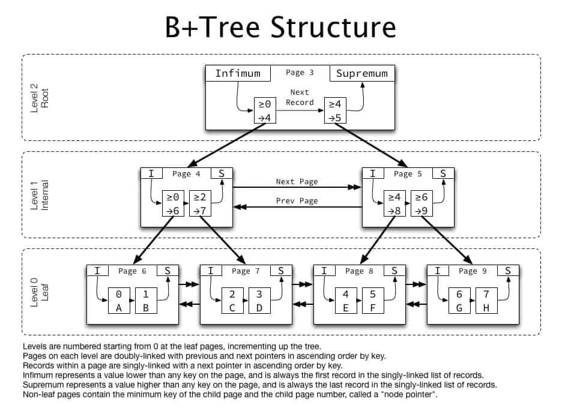
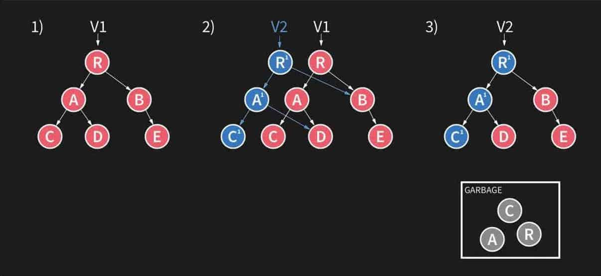
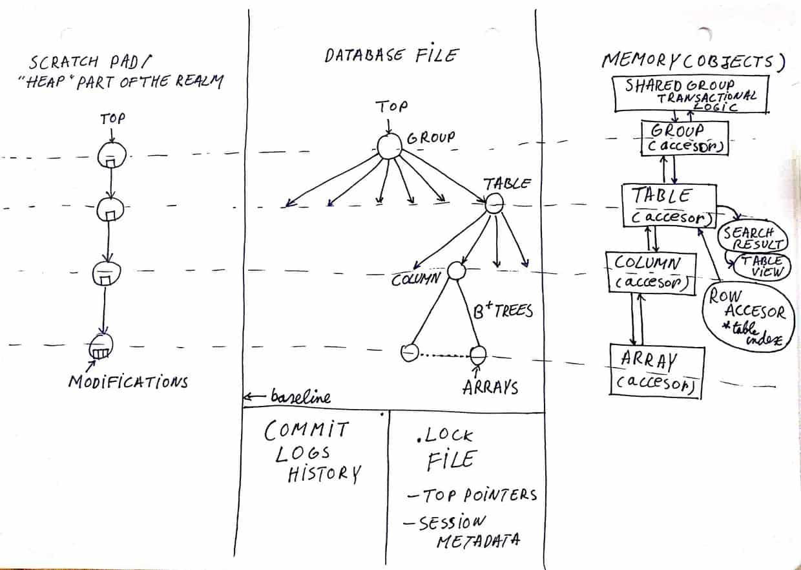

## react-native-storage

#### 方案

react-native-storage 本地存储所有信息（包括图片 base64）

#### 问题

1. 不稳定，不能保证一致性。连续存储
2. 条目数量有限制，超出size限制之后会覆盖之前的记录，更符合本地缓存的场景，但对我们不太适合。
3. 总存储有大小限制 5M。超出范围会抛出异常无法写入。以下日志展现了先存100条记录，再读取的场景，最终日志打印到第97条就停止了。

```plain
05-25 12:23:06.368  6938  7021 I ReactNativeJS: [SUCCESS] key=medicine: getIdsForKey.
05-25 12:23:06.368  6938  7021 I ReactNativeJS: in getAllMedicineIds
05-25 12:23:06.378  6938  7021 I ReactNativeJS: [ '4a0ac3ec-d87e-4ec8-97c8-d310876949da',
...
05-25 12:23:06.378  6938  7021 I ReactNativeJS:   'a9c8beac-7b98-452c-9053-9da98bdb8ee0',
05-25 12:23:06.378  6938  7021 I ReactNativeJS:   '67aeac76-674d-4c4

```

## Realm

```shell
adb pull /data/data/com.frontend/files/default.realm ../frontend/realm
```

虽然总觉得有点偏关系型数据库，但是性能好啊！！而且没得选啊，就用这个8。

#### 优点

1. 跨平台：现在很多应用都是要兼顾iOS和Android两个平台同时开发。如果两个平台都能使用相同的数据库，那就不用考虑内部数据的架构不同，使用Realm提供的API，可以使数据持久化层在两个平台上无差异化的转换。
2. 简单易用：Core Data 和 SQLite 冗余、繁杂的知识和代码足以吓退绝大多数刚入门的开发者，而换用 Realm，则可以极大地学习成本，立即学会本地化存储的方法。毫不吹嘘的说，把官方最新文档完整看一遍，就完全可以上手开发了。
3. 可视化：Realm 还提供了一个轻量级的数据库查看工具，在Mac Appstore 可以下载“Realm Browser”这个工具，开发者可以查看数据库当中的内容，执行简单的插入和删除数据的操作。毕竟，很多时候，开发者使用数据库的理由是因为要提供一些所谓的“知识库”。

#### 缺点

1. 类名称的长度最大只能存储 57 个 UTF8 字符。
2. 属性名称的长度最大只能支持 63 个 UTF8 字符。
3. NSData以及 NSString属性不能保存超过 16 MB 大小的数据。如果要存储大量的数据，可通过将其分解为16MB 大小的块，或者直接存储在文件系统中，然后将文件路径存储在 Realm 中。如果您的应用试图存储一个大于 16MB 的单一属性，系统将在运行时抛出异常。
4. 对字符串进行排序以及不区分大小写查询只支持“基础拉丁字符集”、“拉丁字符补充集”、“拉丁文扩展字符集 A” 以及”拉丁文扩展字符集 B“（UTF-8 的范围在 0~591 之间）。
5. 尽管 Realm 文件可以被多个线程同时访问，但是您不能跨线程处理 Realms、Realm 对象、查询和查询结果。（这个其实也不算是个问题，我们在多线程中新建新的Realm对象就可以解决）
6. Realm对象的 Setters & Getters 不能被重载。因为 Realm 在底层数据库中重写了 setters 和 getters 方法，所以您不可以在您的对象上再对其进行重写。一个简单的替代方法就是：创建一个新的 Realm 忽略属性，该属性的访问起可以被重写， 并且可以调用其他的 getter 和 setter 方法。
7. 文件大小 & 版本跟踪。一般来说 Realm 数据库比 SQLite 数据库在硬盘上占用的空间更少。如果您的 Realm 文件大小超出了您的想象，这可能是因为您数据库中的 RLMRealm中包含了旧版本数据。为了使您的数据有相同的显示方式，Realm 只在循环迭代开始的时候才更新数据版本。这意味着，如果您从 Realm 读取了一些数据并进行了在一个锁定的线程中进行长时间的运行，然后在其他线程进行读写 Realm 数据库的话，那么版本将不会被更新，Realm 将保存中间版本的数据，但是这些数据已经没有用了，这导致了文件大小的增长。这部分空间会在下次写入操作时被重复利用。这些操作可以通过调用 writeCopyToPath:error: 来实现。

> 解决办法：通过调用 invalidate，来告诉 Realm 您不再需要那些拷贝到 Realm 的数据了。这可以使我们不必跟踪这些对象的中间版本。在下次出现新版本时，再进行版本更新。
> 您可能在 Realm 使用 Grand Central Dispatch 时也发现了这个问题。在 dispatch 结束后自动释放调度队列（dispatch queue）时，调度队列（dispatch queue）没有随着程序释放。这造成了直到 RLMRealm 对象被释放后，Realm 中间版本的数据空间才会被再利用。为了避免这个问题，您应该在 dispatch 队列中，使用一个显式的自动调度队列（dispatch queue）。

8. Realm 没有自动增长属性。Realm 没有线程/进程安全的自动增长属性机制，这在其他数据库中常常用来产生主键。然而，在绝大多数情况下，对于主键来说，我们需要的是一个唯一的、自动生成的值，因此没有必要使用顺序的、连续的、整数的 ID 作为主键。

> 解决办法：在这种情况下，一个独一无二的字符串主键通常就能满足需求了。一个常见的模式是将默认的属性值设置为 [[NSUUID UUID] UUIDString]
> 以产生一个唯一的字符串 ID。
> 自动增长属性另一种常见的动机是为了维持插入之后的顺序。在某些情况下，这可以通过向某个 RLMArray中添加对象，或者使用 [NSDate date]默认值的createdAt属性。

#### Realm 到底是什么

先看看官方描述。

> Realm Database: Used by 100k+ developers and downloaded over 2 billion times. Realm Database is a fast, easy to use, and open source alternative to SQLite and Core Data.

大家都知道Sqlite3 是一个移动端上面使用的小型数据库，FMDB是基于Sqlite3进行的一个封装。

那Core Data是数据库么？Core Data本身并不是数据库，它是一个拥有多种功能的框架，其中一个重要的功能就是把应用程序同数据库之间的交互过程自动化了。有了Core Data框架以后，我们无须编写Objective-C代码，又可以是使用关系型数据库。因为Core Data会在底层自动给我们生成应该最佳优化过的SQL语句。

那么Realm是数据库么？Realm 不是 ORM，也不基于 SQLite 创建，而是为移动开发者定制的全功能数据库。它可以将原生对象直接映射到Realm的数据库引擎（远不仅是一个键值对存储）中。

Realm 是一个[MVCC 数据库](https://en.wikipedia.org/wiki/Multiversion_concurrency_control) ，底层是用 C++ 编写的。MVCC 指的是多版本并发控制。Realm是满足 ACID 的。

##### 1.Realm 采用MVCC的设计思想

MVCC 解决了一个重要的并发问题：在所有的数据库中都有这样的时候，当有人正在写数据库的时候有人又想读取数据库了（例如，不同的线程可以同时读取或者写入同一个数据库）。这会导致数据的不一致性 - 可能当你读取记录的时候一个写操作才部分结束。

有很多的办法可以解决读、写并发的问题，最常见的就是给数据库加锁。在之前的情况下，我们在写数据的时候就会加上一个锁。在写操作完成之前，所有的读操作都会被阻塞。这就是众所周知的读-写锁。这常常都会很慢。Realm 采用的是 MVCC 数据库的优点就展现出来了，速度非常快。

MVCC 在设计上采用了和 Git 一样的源文件管理算法。你可以把 Realm 的内部想象成一个 Git，它也有分支和原子化的提交操作。这意味着你可能工作在许多分支上（数据库的版本），但是你却没有一个完整的数据拷贝。Realm 和真正的 MVCC 数据库还是有些不同的。一个像 Git 的真正的 MVCC 数据库，你可以有成为版本树上 HEAD 的多个候选者。而 Realm 在某个时刻只有一个写操作，而且总是操作最新的版本，它不可以在老的版本上工作。

Realm 底层是 B+ 树实现的，在 Realm 团队开源的 [realm-core](https://github.com/realm/realm-core) 里面可以看到源码，里面有用 bpTree，这是一个 B+ 树的实现。B+ 树是一种树数据结构，是一个 n 叉树，每个节点通常有多个孩子，一棵 B+ 树包含根节点、内部节点和叶子节点。根节点可能是一个叶子节点，也可能是一个包含两个或两个以上孩子节点的节点。

B+ 树通常用于数据库和操作系统的[文件系统](http://baike.baidu.com/view/266589.htm)中。NTFS、ReiserFS、NSS、XFS、JFS、ReFS 和 BFS 等文件系统都在使用 B+ 树作为元数据索引。B+ 树的特点是能够保持数据稳定有序，其插入与修改拥有较稳定的对数时间复杂度。B+ 树元素自底向上插入。



Realm 会让每一个连接的线程都会有数据在一个特定时刻的快照。这也是为什么能够在上百个线程中做大量的操作并同时访问数据库，却不会发生崩溃的原因。




上图很好的展现了 Realm 的一次写操作流程。这里分 3 个阶段，阶段一中，V1 指向根节点 R。在阶段二中，准备写入操作，这个时候会有一个 V2 节点，指向新的 R'，并且新建一个分支出来，A' 和 C'。相应的右孩子指向原来 V1 指向的 R 的右孩子。如果写入操作失败，就丢弃左边这个分支。这样的设计可以保证即使失败，也仅仅只丢失最新数据，而不会破坏整个数据库。如果写入成功，那么把原来的 R、A、C 节点放入 Garbage 中，于是就到了第三阶段，写入成功，变成了 V2 指向根节点。

在这个写入的过程中，第二阶段是最关键的，写入操作并不会改变原有数据，而是新建了一个新的分支。这样就不用加锁，也可以解决数据库的并发问题。

**正是B+树的底层数据结构 + MVCC的设计，保证了 Realm 的高性能。**

##### 2.Realm 采用了 zero-copy 架构

因为 Realm 采用了 zero-copy 架构，这样几乎就没有内存开销。这是因为每一个 Realm 对象直接通过一个本地 long 指针和底层数据库对应，这个指针是数据库中数据的钩子。

通常的传统的数据库操作是这样的，数据存储在磁盘的数据库文件中，我们的查询请求会转换为一系列的 SQL 语句，创建一个数据库连接。数据库服务器收到请求，通过解析器对 SQL 语句进行词法和语法语义分析，然后通过查询优化器对 SQL 语句进行优化，优化完成执行对应的查询，读取磁盘的数据库文件(有索引则先读索引)，读取命中查询的每一行的数据，然后存到内存里（这里有内存消耗）。之后你需要把数据序列化成可在内存里面存储的格式，这意味着比特对齐，这样 CPU 才能处理它们。最后，数据需要转换成语言层面的类型，然后它会以对象的形式返回，比如 Objective-C 的对象等。

这里就是 Realm 另外一个很快的原因，Realm 的数据库文件是通过 memory-mapped，也就是说数据库文件本身是映射到内存（实际上是虚拟内存）中的，Realm 访问文件偏移就好比文件已经在内存中一样（这里的内存是指虚拟内存），它允许文件在没有做反序列化的情况下直接从内存读取，提高了读取效率。Realm 只需要简单地计算偏移来找到文件中的数据，然后从原始访问点返回数据结构的值 。

**正是 Realm 采用了 zero-copy 架构，几乎没有内存开销，Realm 核心文件格式基于 memory-mapped，节约了大量的序列化和反序列化的开销，导致了 Realm 获取对象的速度特别高效。**

##### 3. Realm 对象在不同的线程间不能共享

Realm 对象不能在线程间传递的原因就是为了保证隔离性和数据一致性。这样做的目的只有一个，为了速度。

由于Realm是基于零拷贝的，所有对象都在内存里，所以会自动更新。如果允许 Realm 对象在线程间共享，Realm 会无法确保数据的一致性，因为不同的线程会在不确定的什么时间点同时改变对象的数据。

要想保证多线程能共享对象就是加锁，但是加锁又会导致一个长时间的后台写事务会阻塞 UI 的读事务。不加锁就不能保证数据的一致性，但是可以满足速度的要求。Realm 在衡量之后，还是为了速度，做出了不允许线程间共享的妥协。

**正是因为不允许对象在不同的线程间共享，保证了数据的一致性，不加线程锁，保证了 Realm 的在速度上遥遥领先。**

##### 4. 真正的懒加载

大多数数据库趋向于在水平层级存储数据，这也就是为什么你从 SQLite 读取一个属性的时候，你就必须要加载整行的数据。它在文件中是连续存储的。

不同的是，我们尽可能让 Realm 在垂直层级连续存储属性，你也可以看作是按列存储。

在查询到一组数据后，只有当你真正访问对象的时候才真正加载进来。

##### 5. Realm 中的文件



+ Database File：.realm 文件是 memory mapped 的，所有的对象都是文件首地址偏移量的一个引用。对象的存储不一定是连续的，但是 Array 可以保证是连续存储。.realm 执行写操作的时候，有3个指针，一个是*current top pointer ，一个是 other top pointer ，最后一个是 switch bit*。

  + switch bit 标示着 top pointer 是否已经被使用过。如果被使用过了，代表着数据库已经是可读的。
  + the top pointer 优先更新，紧接着是 the switch bit 更新。因为即使写入失败了，虽然丢失了所有数据，但是这样能保证数据库依旧是可读的。
+ .lock file：.lock 文件中会包含 the shared group 的 metadata。这个文件承担着允许多线程访问相同的 Realm 对象的职责。
+ Commit logs history：这个文件会用来更新索引 indexes，会用来同步。里面主要维护了 3 个小文件，2 个是数据相关的，1 个是操作 management 的。

#### 总结

经过上面的分析之后，深深的感受到 Realm 就是为速度而生的！在保证了 ACID 的要求下，很多设计都是以速度为主。当然，Realm 最核心的理念就是对象驱动，这是 Realm 的核心原则。Realm 本质上是一个嵌入式数据库，但是它也是看待数据的另一种方式。它用另一种角度来重新看待移动应用中的模型和业务逻辑。

Realm 还是跨平台的，多个平台都使用相同的数据库，是多么好的一件事情呀。相信使用Realm作为 App 数据库的开发者会越来越多。

## 参考

1. [react-native-storage 的存储上限逻辑](https://github.com/sunnylqm/react-native-storage/issues/111)
2. [Database alternatives for Mobile (NoSQL ) A glance to Realm and Couchbase Lite](https://medium.com/@oznusem/database-alternatives-for-mobile-nosql-glance-to-realm-and-couchbase-lite-c7ed425de6a1)
3. [Realm数据库 从入门到“放弃”](https://juejin.im/post/580cf6f1570c350068f11080)

