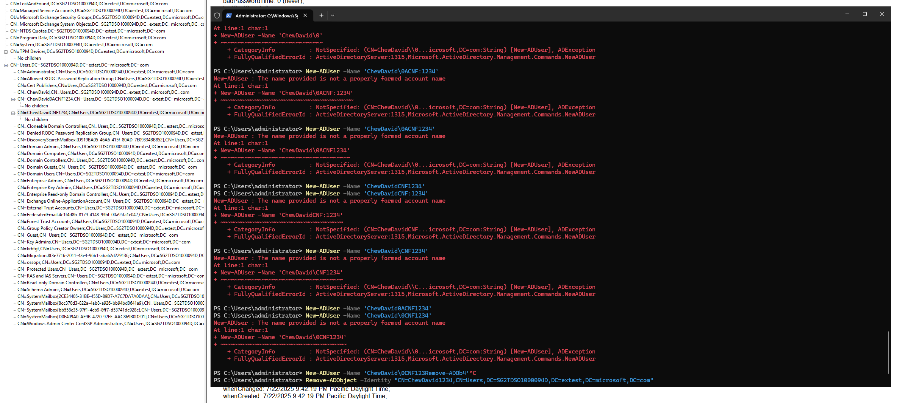
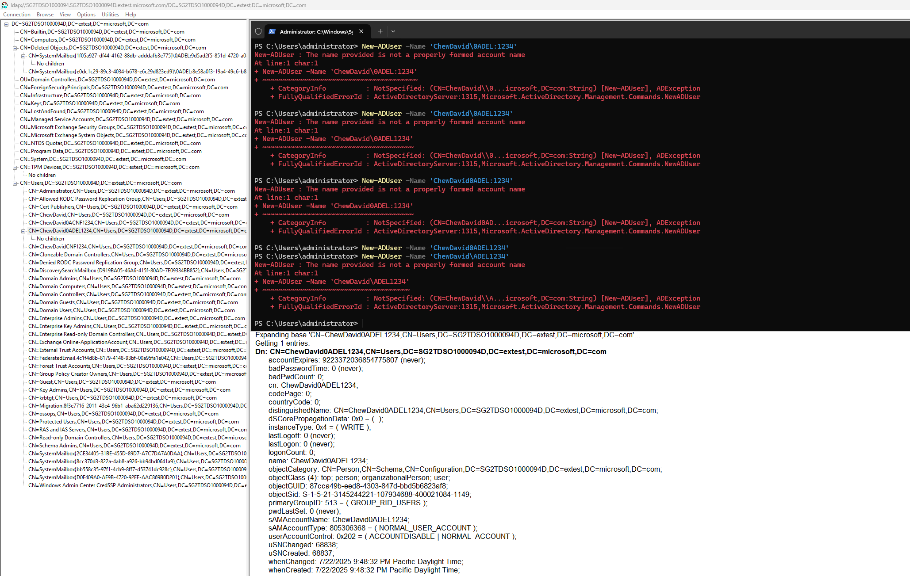

基于[前文](/study_notes_as_ad_beginner) ChatGPT 提到的如下理论，我实际测试了一下 AD 中的命名规则。首先，`CNF`、`DEL` 本身并不是 AD 的保留字或特殊字符，只有当它们和 `\0A` 一起使用时才有特殊含义。而根据实践，真正被限制的其实是字符 `\`。

> Active Directory 不阻止用户人为创建包含 `\0ACNF:` 或 `\0ADEL:` 的 CN / DN

## 对 CNF 对象

可以看出 `:` 和 `\` 是被严格限制的字符，不能直接用于 CN 中。

## 对 DEL 对象

类似地，除了 `:` 和 `\` ，其他字符都可以作为对象名使用。

## 其他特殊字符

我还测试了一些其他特殊字符，但是除了 `/` 和 `*` 外，暂未发现其他受限制的字符。`!`、`@`、`#`、`$`、`%`、`^`、`&`、`(` 等都可以正常作为名字的一部分输入。（考虑到 RID Master 的 CN 为 `RID Manager$`，说明 `$` 是可以被使用的，因此测试时就没有再重复验证了。）

## 实际存储在 ESE 中的数据

需要注意的是，对于 user `ChewDavidCNF1234#`，其在数据库中实际存储的属性 `name` 并不包含 `\`。但通过 LDP 查看时会显示 `\`，这可能是由于转义或显示格式所致。

